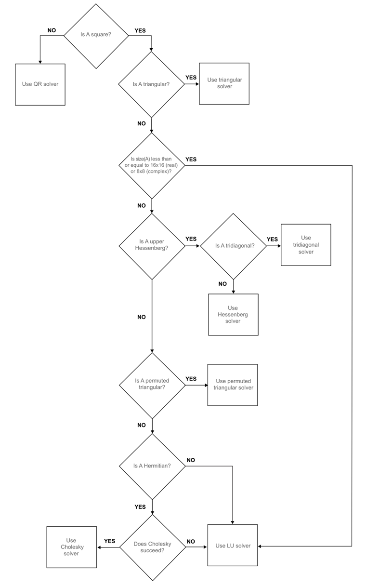

# Matrix Solve Replication

## Overview
This project aims to replicate MATLAB's right division operator (`/`) functionality, which is primarily used for solving linear equations or systems of linear equations. The right division operator in MATLAB simplifies the process of finding solutions to matrix equations of the form `AX = B`. This replication focuses on providing a similar functionality, enabling users to solve matrix systems efficiently in a different programming environment. 

## Features
- **Matrix Equation Solver**: Solve matrix equations of the form `AX = B` efficiently.
- **Compatibility**: Designed to be compatible with various data structures and matrix formats.
- **High Precision**: Ensures high precision in calculations to produce reliable results.
- **Easy to Use**: Simple and intuitive interface for users familiar with MATLAB's syntax.
- **Testing**: Tests to insure correctness of methods

## Getting Started
```bash
git clone https://github.com/ctaylo41/MatrixLibary
```
## How to Use
This libary uses 2d vectors that take complex doubles(vector<vector<std::complex<double>>>)
To create a nxn idenity matrix Matrix name(n)
To create a nxm matrix of all 0s use Matrix name(n,m)
To solve for sparse systems do A/=b
To solve for full systems do A/b
There is also a Vector libary that can be used as well

## Testing
To test library install google test, there are tests written for all methods and functions used in the library.



 